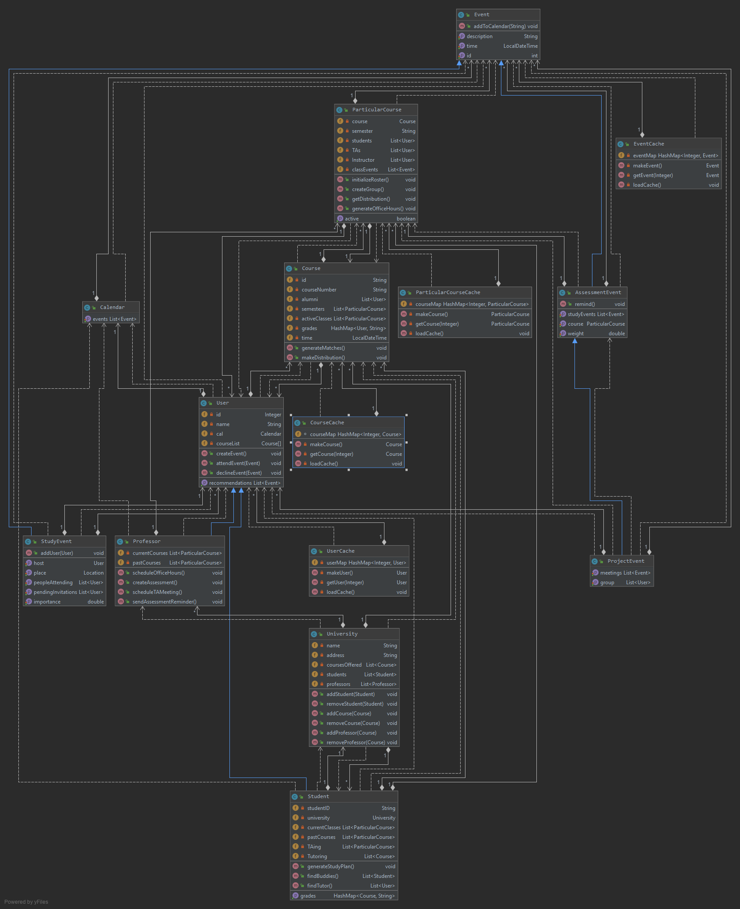

# Design

# Architecture
Most of the tools will be from the Toolbox.
We will use the Google Calendar API to view a user's current events and use that to schedule other events,
such as study sessions. We wil need to use methods such as getting all the events, searching for busy times, creating and
deleting events. We also need to integrate with SIS to create classes that can be joined by students. For that, we can use
the SIS API.
When a user creates their profile, they can connect with their Google Calendar (done through the Calendar API). They can
also pick classes that are added from the SIS database. The app can compare different schedules and suggest events, which
can then be added to the user's calendar.

## Tools Outside the Toolbox
- Google Calendar API - use it to synchronize with user's calendar, learn from documentation
- JHU SIS API - use it to add classes based on the JHU SIS catalog, learn from documentation

# Class Diagram
### Design Principles:
1. Don't Repeat Yourself - There are no functions / methods which have the same functionality in multiple classes. That is, each function is unique due to our use of inheritance.
2. Liskov Substitution - All of the functions which can be called on User can also be called on Student and Professor. All of the functions which can be called on Event can also be called on AssessmentEvent, ProjectEvent and StudyEvent.
3. Open-Closed Principle - Classes like User, Event, Course will never have to change, but they are enhanced by other, separate classes.
4. Single Responsibility Principle - The Caches only have the responsibility of creating specific cloneable objects. Calendar has the single responsibility of storing a list of events.

### Design Patterns
Factory Pattern (The Cache classes are all factories which can produce a lot of cloneable objects)

