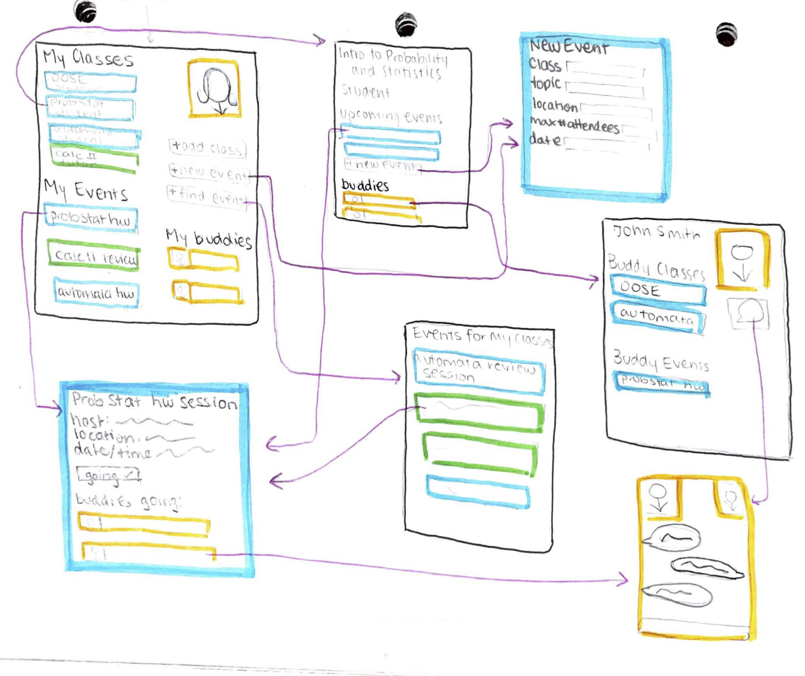
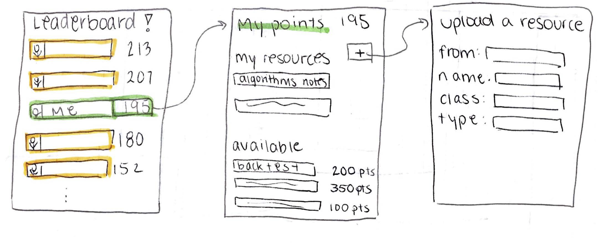

# Study Buddy

# Elevator Pitch

For many university students, the difference between success and failure in a course
is whether or not they have one or two good study partners taking the class with
them. Whether it's working through homework problem sets together, setting up
pre-exam review sessions, or even just having someone to get notes from or confirm exam
dates, a few good study buddies is imperative to getting a good grade. But in
our world of social media relationships, it can be hard for students to introduce
themselves to others in the class to create these study groups. It's also hard to find time in everyone's busy schedules. Study Buddy is the solution: a social media for in-class connections, forming study groups,
planning review sessions, and overall success in classes.

# Problem

Students need help meeting others in their classes, forming study groups, and
scheduling a time and place to study together.

## Introduction to Domain
All terms are pretty self-explanatory here :)

# Solution

Students can create profiles that include all of their classes, and the app will
connect them with others in their class and events going on to study for the class,
as well as facilitate the student creating their own study events. Studies have shown
turning something into a form of social media greatly increases user retention
and satisfaction.

## Architecture Overview

Mobile app, desktop app, web server

## Features

####Primary
- Students have a profile that includes all the classes they're taking and other weekly commitments, as well
as classes they're willing to tutor
- Study Buddy app will analyze user profile data and recommend
users for each other who have compatible courses, schedules, majors, possibly even compatible skill
levels
- There will be an option for TA's/Professors to see times when most of their students
are available, in order to host effective office hours
- Once groups are formed, Study Buddy will dynamically keep track of group members'
schedules, and find ideal meeting times for future study sessions
####Secondary
- Students can create events to study with others in the class
- Each event has a homepage with details (when/where/how many can attend) as well as
details about the activity ("we'll be working on data structures assignment 4")
- Each course has a home page that links to other students in the class, and all
created events for the class
- Students can indicate whether or not they're attending an event, and it will appear
on their profile, as well as on the event homepage
####Tertiary
- Students can tutor for a class for payment (ex: $1 per student who attends)
- Students can also win points by uploading course notes, back tests, other study
materials from courses they've already taken. Then, they can use the points they win
to unlock materials other students have uploaded from the classes they're currently in.  
- Students win points for every event they attend or host, as well as for
getting high ratings on their tutoring sessions. A leaderboard shows who is winning
at being the "best study buddy".
- Class/Professor reviews on private forum

## Wireframes

<!--TODO-->

**Events Map (Mobile App)**

**Leaderboard and Unlocking Resources**

## User Stories

As a student in Discrete Mathematics, I want to meet others in the class so we
can figure out the homework together. I add Discrete Mathematics to my profile
and create a new event called "Discrete Math homework 2" for next Tuesday at
3pm in Brody. When I create the event, the app notifies all the other students
and 6 others from the class mark themselves as "going". On Tuesday we meet
at the place & time specified, and we are able to complete the homework together
with such success that we decide to make it a recurring event. We all ace
Discrete Mathematics :)

As a senior pre-med, I want to take advantage of all the nervous freshmen and
offer my tutoring services for Intro Chem next Saturday afternoon. I reserve a
large room and I indicate on my Study Buddy event that I will be charging
$2 for every student who attends. On Saturday, 50 freshmen come to my tutoring session.
I make $100, the freshmen learn chemistry, and everyone is happy :)

As a freshman in Calculus II, I wait until the day before my midterm before
realizing I have no idea what's going to be on the exam. I pull out my Study
Buddy app and search for events for Calculus II. I find that 5 other students
are meeting in the Wolman study room tonight to review for the exam. I mark
myself as going, and the next day I pass my exam (and know not to wait until the
last minute next time).  

# Viability

## Hardware

Yes, We have all the necessary hardware.

## APIs

Need to integrate with Google Calendar to update events and analyze student schedules for free time. Also would need
to integrate either with JHU SIS or Semester.ly to get course information. Potentially,
Integrate with Facebook API for the messaging/event aspect.

## Tools

<!--TODO-->

- XCode
- Swift
- Java
- IntelliJ
- Javascript
- Gradle

## Proof of Concept

This app is essentially a more organized and specialized type of social media -
apps like Facebook, Instagram, and Piazza have had major success.

# Difficulty

This app is difficult because we have to elegantly manage classes, events, location data,
to automatically create useful event recommendations and develop an organized database of course materials.
This will likely involve big data processing and some implementation of graph theory.

# Market Research

## Users

Universities, students, tutors, course assistants, and professors. Currently developing for Hopkins, but plan to
expand for multiple universities.

## Competition

There's not really an app like this, but we need to make the features more
useful than something you could just accomplish through Facebook/texting.

# Roadmap

https://github.com/jhu-oose/2019-student-sweill/projects/1
